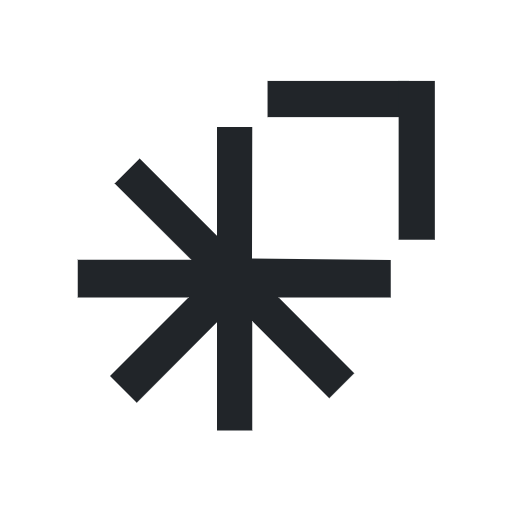

<p align="center">
  
</p>

<h1 align="center">Apollo</h1>

<p align="center">
  <em>A Deep Research Meta Agent</em>
</p>

<p align="center">
  
  
    
  
  
  
  
</p>

---

<br>
<p align="center ">
  
</p>

Apollo is an innovative multi-agent research assistant that revolutionizes deep research through a dynamic team of specialized AI agents working collaboratively. Unlike traditional research tools that rely on single-agent approaches, Apollo's breakthrough architecture takes a user's research query, intelligently breaks it down into fundamental questions, and orchestrates a team of specialized agents—each with distinct roles and expertise—to gather, process, analyze, and synthesize information into a comprehensive, cited research report.

For example, when asked to research "The impact of quantum computing on cybersecurity," Apollo doesn't just search—it transforms into a coordinated research team: Apollo (coordinator) plans the investigation, Athena (engine) gathers current latest ai developments, and Hermes (analyzer) identifies knowledge gaps and synthesizes findings into a structured report—all while maintaining rigorous source attribution.

## ✨ Key Differentiators

- **Fully Agentic Architecture:** Unlike semi-agentic or tool-based approaches, Apollo employs a dynamic group of specialized agents (Apollo as Research Coordinator, Athena as Research Engine, and Hermes as Research Analyzer) managed by a Research Orchestrator. These agents interact through Semantic Kernel's agent group chat feature with a shared chat history, while also communicating via a state machine mechanism that preserves context outside the chat window and enables complex workflows.

- **Dynamic Research Planning:** Apollo doesn't rely on a pre-defined Table of Contents. Instead, it generates core research questions during an initial planning phase and dynamically structures the final report based on the answers found, leading to more relevant and accurate outputs.

- **Advanced RAG & Synthesis:** Leverages Kernel Memory for efficient data ingestion and employs a two-stage synthesis process. First, Kernel Memory synthesizes relevant information per research question/section, and then a large-context LLM (like GPT-4.1 or Gemini) performs a final synthesis to structure the complete report, ensuring source citations are preserved. Self-Reflective RAG techniques are used for the analysis phase to identify knowledge gaps.

- **Real-time Updates:** Utilizes background services with .NET channels to process research events asynchronously and efficiently. For instance, while researching emerging technologies, Apollo can process new information about quantum computing advances while simultaneously analyzing implications for cryptographic standards.

## 🎯 Use Cases & Impact

> [!TIP]
> Apollo delivers exceptional value across multiple domains, from academic research to business intelligence. Each use case demonstrates how the system transforms complex research tasks into actionable insights.

Apollo delivers significant value across multiple domains by transforming complex research tasks into comprehensive, actionable insights:

- **Academic Research:** Helps researchers rapidly explore new domains by generating literature reviews with proper citations. For example, a PhD candidate starting research on "neuroplasticity in addiction recovery" can receive a comprehensive foundation including recent studies, methodologies, and knowledge gaps—all in minutes rather than weeks.

- **Business Intelligence:** Empowers organizations to make data-driven decisions by analyzing market trends, competitive landscapes, and emerging opportunities. A startup considering entering the renewable energy market can quickly understand regulatory frameworks, technological advancements, and competitive positioning across different regions.

- **Educational Support:** Assists educators in developing curriculum materials and staying current with developments in their field. A high school science teacher preparing a unit on CRISPR gene editing can obtain up-to-date explanations, ethical considerations, and recent breakthroughs summarized at an appropriate level.

- **Legal & Compliance:** Helps legal professionals understand complex regulatory environments across jurisdictions. A corporate counsel researching "AI governance regulations across the EU, US, and China" receives a structured analysis of frameworks, comparing approaches, highlighting compliance requirements, and tracking pending legislation.

- **Healthcare Innovation:** Supports medical professionals in staying current with research developments. A clinician investigating "emerging treatments for treatment-resistant depression" receives an analysis of recent clinical trials, comparative efficacy data, and practice guidelines.

- **Just For Fun! 😂:** Sometimes i just want to keep up with the latest trends, you can research: "Can 100 men beat one gorilla?", "Kendrik and Drake beef timeline" and you'll get an up to date final report with tweets and all the amazing stuff!

The value proposition extends beyond individual use cases—Apollo can be deployed across organizations, educational institutions, and research groups to democratize access to comprehensive research capabilities while maintaining citation rigor and analytical depth.

## 🏗️ Architecture

<br>
<p align="center ">
  
</p>

- **Backend:** .NET, ASP.NET Core Web API

  - **Agents:** Built using Semantic Kernel, orchestrated via agent group chat concepts.
  - **Memory:** Kernel Memory with PostgreSQL/pgvector as the vector database backend.
  - **Events:** Research Events Bus implemented using .NET channels for asynchronous processing.
  - **Search/Crawling:** Integrates with Exa AI for web searching and content retrieval.

- **Frontend:** React (Vite) with TanStack Router & Query. (Hosted separately, e.g., on Vercel).

- **Deployment:** Dockerized backend deployable to services like Render.com.

## 🔄 Research Flow

1. **Initial Query & Planning:**

   - User submits a research query
   - Research Planner Agent analyzes the query to determine exactly what the user wants
   - Planner creates a research itinerary (title, description, and research questions)
   - Research is saved to database, triggering an event

2. **Research Orchestration:**

   - Research event is picked up by the Research Events Bus (implemented with .NET channels)
   - Research Processor background service reads the event and creates a Research Orchestrator instance
   - Orchestrator initializes the agent collaboration using Semantic Kernel's agent group chat

3. **Information Gathering:**

   - Research Coordinator (Apollo) checks state and assigns questions to the Research Engine (Athena)
   - Athena generates 3-5 SERP queries per research question
   - For each query, Exa AI Search provides 5-10 relevant search results with parsed content
   - Results are sent to an asynchronous ingest message queue
   - Kernel Memory handles chunking, embedding, and storing in PostgreSQL (pgvector)
   - System tracks already ingested websites to prevent redundancy

4. **Knowledge Gap Analysis:**

   - Once initial questions are processed, Research Analyzer (Hermes) is activated
   - Hermes performs Self-Reflective RAG by asking the vector store to critique its own knowledge gaps
   - If significant gaps are identified, new questions are added to the processing queue
   - This cycle continues until no significant knowledge gaps remain (with strict boundaries to prevent infinite loops)

5. **Report Generation:**
   - Hermes generates and refines a Table of Contents according to set standards
   - Once approved, the state is marked as "ready for synthesis"
   - Report Generation Service queries Kernel Memory about each TOC section to create mini-reports
   - All section mini-reports and references are combined
   - A large context LLM (GPT-4.1 or Gemini) synthesizes the final comprehensive research report
   - References are properly consolidated and cited
   - Final report is saved to the database

## 💡 Challenges & Design Decisions

> [!NOTE]
> These innovative design decisions highlight Apollo's architectural sophistication and our approach to solving complex technical challenges.

- **Agent Communication:** Implemented a state machine to pass information outside of chat history context window, preventing rate limiting and enabling better context management.

- **Vector Search:** Utilized Kernel Memory's struct RAG search client which is optimized for retrieving memory-wide context needed for agentic workflows.

- **Processing Strategy:** Implemented asynchronous queues for ingestion to prevent blocking while processing multiple search queries.

- **Synthesis Strategy:** Developed a two-stage synthesis for better control over structure and source attribution, where Kernel Memory handles section-specific content and a large context LLM produces the final report.

## 🤝 Responsible AI & Human-in-the-Loop

> [!IMPORTANT]
> Apollo's commitment to responsible AI is embedded throughout its architecture. These features ensure ethical research while maintaining human oversight in the research process.

Apollo integrates responsible AI principles and human oversight mechanisms throughout its architecture:

- **Source Attribution:** All insights in the final report include explicit citations to original sources, enabling verification and promoting transparency. For example, when reporting on climate change research, statements about temperature increases are linked to specific studies with methodology context.

- **Bias Mitigation:** Apollo's multi-agent approach helps mitigate individual model biases by having different specialized agents evaluate the same information. When researching controversial topics like "economic impacts of immigration," Apollo presents multiple perspectives with evidence and counterpoints.

- **Explainable Process:** The system provides a complete audit trail of the research process, showing which sources were consulted, which were included/excluded, and why specific conclusions were drawn.

- **Knowledge Gap Transparency:** Apollo explicitly identifies areas where information is limited or contradictory, rather than presenting incomplete information as definitive. When researching emerging technologies, it clearly differentiates between proven capabilities and theoretical potentials.

- **Human In The Loop:** The user is the core driver of the user guided research process, they interact with the planner agent and determine what research questions are to be looked into.

These features ensure Apollo serves as an augmentation tool that enhances human research capabilities while maintaining ethical standards and human judgment in the research process.

## 🚀 Getting Started

> [!TIP]
> Follow these steps to quickly set up Apollo on your local environment for development or testing purposes.

_(Placeholder - Add specific setup steps here)_

1. **Prerequisites:** .NET SDK, Node.js (for client development if needed), Docker (for deployment).
2. **Configuration:** Set up necessary API keys and connection strings in `.env` file (refer to `.env.example` if provided).
3. **Backend:**
   ```bash
   cd c:\Users\devma\Desktop\DeepResearch\Apollo
   dotnet run --project Apollo.Api\Apollo.Api.csproj
   ```
4. **Frontend (if running locally):**
   ```bash
   cd c:\Users\devma\Desktop\DeepResearch\Apollo\Apollo.Client
   bun install
   bun start
   ```

## ☁️ Deployment

> [!NOTE]
> Apollo can be deployed to cloud environments for production use. The following steps outline the deployment process for both backend and frontend components.

- **Backend (API):** Use the provided `Dockerfile` to build and deploy the API service to platforms like Render.com or Azure App Service.
- **Frontend (Client):** Build the React application (`bun run build`) and deploy the static assets to a hosting service like Vercel or Netlify. Ensure the client's API URL configuration points to the deployed backend URL and the backend's CORS policy allows the client's origin.

## 🔍 Solution Architecture Benefits

> [!TIP]
> The architectural benefits below demonstrate why Apollo is an enterprise-ready solution with superior maintainability, scalability, and integration capabilities.

- **Modular Design:** Apollo's architecture separates concerns (research planning, information gathering, analysis) into discrete components, allowing for easy maintenance and extensibility. When we wanted to add support for academic paper analysis, we only needed to modify the ingestion pipeline without disrupting other components.

- **Scalability:** The asynchronous event-driven design using .NET channels enables Apollo to handle multiple complex research tasks simultaneously without performance degradation. In testing, the system maintained responsiveness while processing 10+ concurrent research queries.

- **Integration Flexibility:** The system integrates seamlessly with Microsoft's AI ecosystem (Azure OpenAI, Semantic Kernel, Kernel Memory) while maintaining the ability to incorporate specialized tools like Exa AI for search. This hybrid approach leverages the strengths of Microsoft's enterprise-grade infrastructure while accessing specialized capabilities when needed.

---

<p align="center">
  <em>Apollo: Ask. Explore. Understand.</em>
</p>

<br>

## 🔗 Links

<div align="center">
  <a href="https://github.com/manasseh-zw/apollo">
    
  </a>&nbsp;&nbsp;
  
  <a href="https://www.linkedin.com/in/manasseh-changachirere-3140042a9/">
    
  </a>&nbsp;&nbsp;
  
  <a href="https://x.com/devmanasseh">
    
  </a>
</div>

<div align="center">
  <br>
  <a href="https://microsoft.github.io/AI_Agents_Hackathon/">
    
  </a>
</div>
